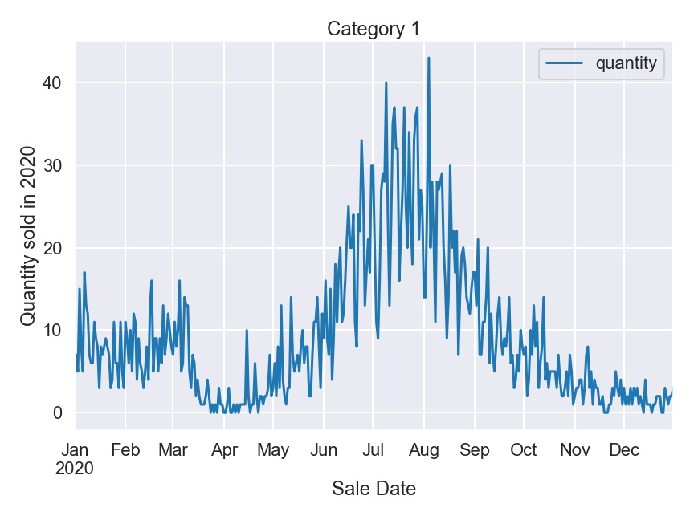
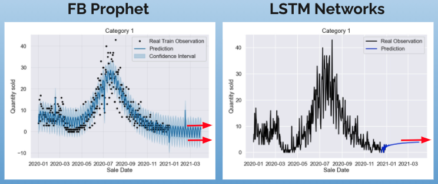
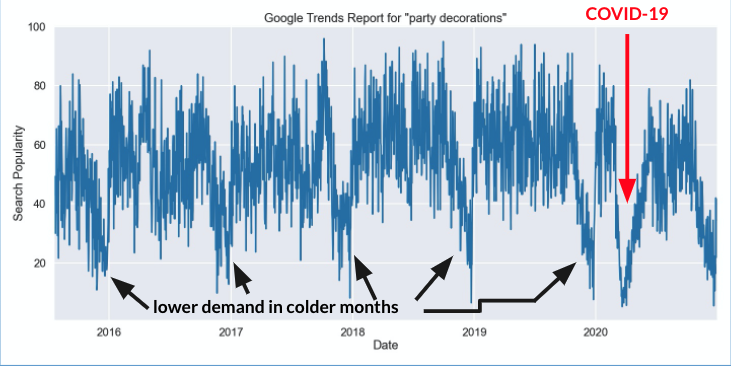

   

Photo by <a href="https://unsplash.com/@adigold1?utm_source=unsplash&utm_medium=referral&utm_content=creditCopyText">Adi Goldstein</a> on <a href="/s/photos/balloon-party-decoration?utm_source=unsplash&utm_medium=referral&utm_content=creditCopyText">Unsplash</a>

# Inventory management for Etsy small business

A small business selling party supplies on Etsy needs help managing inventory. They obtain the inventory over-seas so restocking items have long lead-times. The Etsy shop needs help identifying in advance which items need to be reordered.

They asked to review their historical sales data for 2020 calendar year, group items into categories based on similar tags/theme and analyze shop's top selling categories. The goal is to create a model that best forcasts quantities of each category sold 3-6 months in advance. 

# Data Collection

1/1/2020 - 12/13/2020 sales data was provided by the business owner that contained details about date items were sold on, quantities sold and generalized shipping information.

Additionally, detailed item descriptions were obtained from <a href="https://www.etsy.com/developers/documentation/getting_started/api_basics">Etsy API</a>. Descriptions included item titles, descriptions, tags used to search for items on the website, number of views and favorers on Etsy. Tags were later used to group items into categories; 12 categories in total.

As an example, let's focus our analysis on category 1 to determine the best algorithm to predict future demand.

   

 

# Methods

Time series analysis was used in order to determine the best model to predict inventory demands. Each algorithm was evaluated on train / test split RMSE metrics. The following statistical models were applied:

1. ARIMA(order=4,1,5)

2. SARIMAX with the popularity of search term “party decorations” on Google used as an exogenous variable

3. FB Prophet with various seasonalities and growth variables

4. LSTM Networks with various look back intervals

# Evaluation

   

   

LSTM model with look_back=14 has the best train/test RMSE results. Let's fit our final model next.

# Future Demand Prediction

   

  

Both, FB Prophet and LSTM Networks, produce disappointing results when predicting the demand for category 1 three months into the future. The models quickly converge to a single number for LSTM and two numbers for FB Prophet (indicated by red arrows).

**What's going on? Why did we get great results on train/test split data, but essentially just a single number when we predict into the future?** The answer is data. We can intuitively pick up on the yearly seasonality in the data: the demand for category 1 slows down in the colder months and increases in the warmer months. If we look at the popularity of “party decorations” on Google, we can see a similar picture; we can see that the search for “party decorations” slows down in the colder months and increases in the warmer months.

   

  
So the weakness of our models are not the models themselves, but the fact that we only gave one year of data to predict on. And because the data is limited, the models are not able to pick up on the yearly seasonality to make meaningful predictions into the future.

# Next Steps
- Get access to more data (before and after 2020)
- Add more exogenous variable(s), such as weather temperature
- Perform analysis and forecast on exogenous variable(s)
- Add models with yearly seasonality

# Repository Structure

- **images** folder contains images used in README.md and presentation.

- **Category_1_presentation.pdf** contains presentation of the modeling process for category 1.

- **google_API_notebook.ipynb** notebook contains results from Google Trends.

- **notebook_EDA&visualizations.ipynb** notebook contains project EDA and visualizations.

- **notebook_cat1_ARIMA_SARIMAX.ipynb** notebook contains ARIMA and SARIMAX modeling process for category 1.

- **notebook_cat1_Prophet.ipynb** notebook contains FB Prophet modeling process for category 1.

- **nnotebook_cat1_lstm.ipynb** notebook contains LSTM modeling process for category 1.

- **notebook_cat1_evaluation_coclusions.ipynb** notebook contains modeling evaluation and conclusions for category 1.