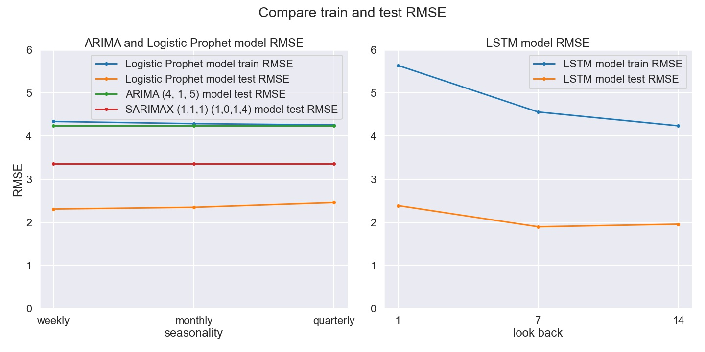

   

# Inventory management for Etsy small business

A small business selling party supplies on Etsy needs help managing inventory. They obtain the inventory over-seas so restocking items have long lead-times. The Etsy shop needs help identifying in advance which items need to be reordered.

They asked to review their historical sales data for 2020 calendar year, group items into categories based on similar tags/theme and analyze shop's top selling categories. The goal is to create a model that best forcasts quantities of each category sold 3-6 months in advance. 

1/1/2020 - 12/13/2020 sales data was provided by the business owner that contained details about date items were sold on, quantities sold and generalized shipping information.

Additionally, detailed item descriptions were obtained from Etsy API. Descriptions included item titles, descriptions, tags used to search for items on the website, number of views and favorers on Etsy. Tags were later used to group items into categories; 12 categories in total.

As an example, let's focus our analysis on category 1 to determine the best algorithm to predict future demand.

# Methods

Time series analysis was used in order to determine the best model to predict inventory demands. Each algorithm was evaluated on train / test split RMSE metrics. The following statistical models were applied:

1. ARIMA(order=4,1,5)

2. FB Prophet with various sesonalities and growth variables

3. LSTM Networks with various look back intervals

# Evaluation

   

   

LSTM model with look_back=14 has the best train/test RMSE results. We can fit our final model to it.

# Next Steps
- Add exogenous variable(s)
- Add SARIMAX model
- Add LSTM with Conv1D model

# Repository Structure
- **data** folder contains Zillow Research dataset.

- **images** folder contains images used in README.md and presentation.

- **Forecasting_real_estate_prices_presentation.pdf** contains the final presentation.

- **notebook_Final.ipynb** notebook contains the final modeling process.